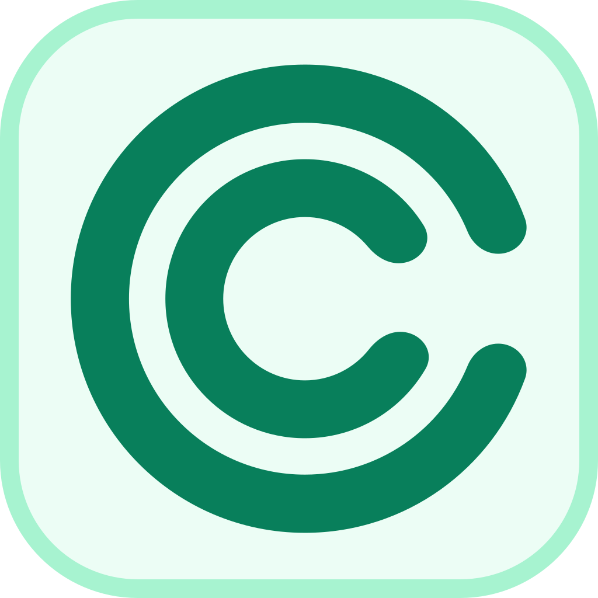
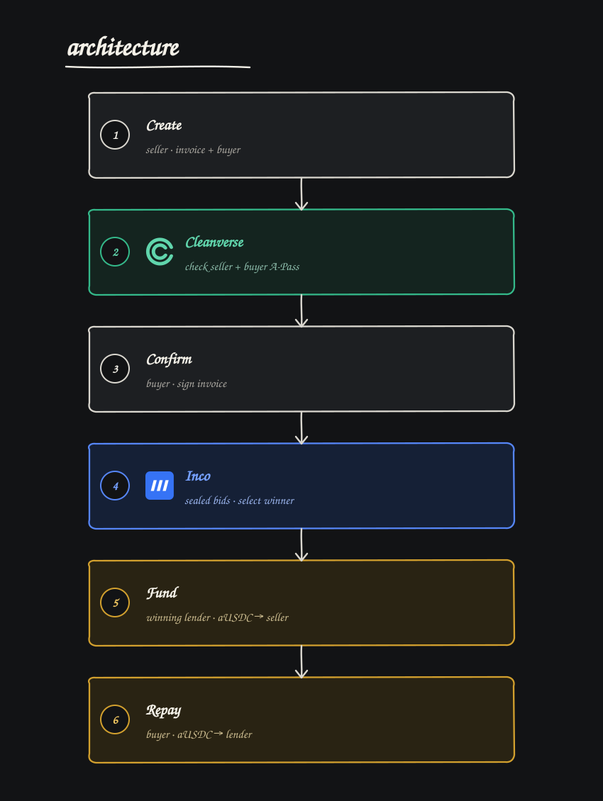

# Bidnox

<p>
  <a href="https://www.cleanverse.com/"></a>
  &nbsp;&nbsp;&nbsp;
  <a href="https://www.inco.org/"></a>
</p>

**Cleanverse-first settlement and compliance, with confidential bidding powered by Inco.**

Bidnox is an invoice-financing marketplace where verified financiers compete to fund a supplier without seeing one another's offers.

The idea is simple: a supplier should be able to find the best advance for a buyer-confirmed invoice without emailing the same financial terms to a room full of lenders. Bidnox keeps every bid encrypted while the auction is open, reveals only the winning financier and winning amount when it closes, and settles the financing and repayment in Cleanverse aUSDC on Base Sepolia.

[Website](https://bidnox.xyz) | [Open the app](https://app.bidnox.xyz) | [View deployed contracts](#base-sepolia-deployment)

> Built for the RWA track of Cleanverse Build: Trusted Assets. Bidnox uses Cleanverse CVI and CVA from receivable issuance through settlement.

## Hackathon submission

| Item | Link |
| --- | --- |
| Public repository | [Bidnox monorepo](https://github.com/Bidnox/monorepo) |
| Live product | [app.bidnox.xyz](https://app.bidnox.xyz) |
| Slide deck | [View the presentation](bidnox-slides.pdf) |
| One-page summary | [Read the summary](docs/submission/one-page-summary.md) |
| Demo evidence | [Review the transactions](docs/submission/demo-evidence.md) |
| Demo video | **TODO: add the final video link** |
| Deployed chain | Base Sepolia, chain ID `84532` |

## How it works



1. **The supplier creates a receivable.** The demo publishes the invoice file to IPFS through Pinata and anchors a CID-derived commitment alongside the face value, buyer, due date and settlement asset.
2. **The buyer confirms the terms.** The buyer signs the exact receivable, so a supplier cannot auction an unacknowledged invoice.
3. **The supplier opens an auction.** The auction has a closing time and a minimum acceptable advance.
4. **Verified financiers submit sealed bids.** Each financier passes a Cleanverse A-Pass check. The bid amount is encrypted in the browser with Inco Lightning before it is sent to the contract.
5. **The contract selects the best offer privately.** Inco compares encrypted values without publishing the individual bids. At finalization, only the winner and winning advance are revealed; losing offers remain sealed.
6. **The winning financier funds the supplier.** The financier approves the exact winning amount and the registry transfers that amount in Cleanverse aUSDC to the supplier.
7. **The buyer repays the financier.** On the due side of the lifecycle, the buyer transfers the invoice's full face value in aUSDC to the winning financier.

Every important write produces a Base Sepolia transaction that the app links from the receivable and its evidence page.

## What is private and what is public

Bidnox is deliberately precise about its privacy guarantees.

**Kept private**

- bid amounts while the auction is open;
- every losing bid after the auction is finalized.

**Public or visible onchain**

- seller, buyer and bidder wallet addresses;
- the uploaded demo invoice through its public IPFS gateway link;
- invoice fingerprint, face value, due date and auction reserve;
- the number of bids and lifecycle transactions;
- the winning financier and winning advance after finalization.

This is sealed-bid financing, not anonymous financing or private document storage. The current demo makes invoice evidence publicly viewable on IPFS and protects the commercially sensitive lender offers.

## Cleanverse comes first

Cleanverse is the compliance and settlement layer.

- **CVI and A-Pass:** The server checks participant eligibility and issues a short-lived EIP-712 permit bound to one wallet, action, receivable and asset. Contracts consume these permits during creation, confirmation, bidding, funding and repayment.
- **CVA and aUSDC:** The winning financier pays the supplier in Cleanverse aUSDC. The buyer later repays the financier with the same asset.

API credentials and the compliance signing key stay on the server and never reach the browser.

### Confidential bidding with Inco

Inco Lightning is the confidential-compute layer. The browser encrypts each bid for the auction contract, and the contract maintains the leading bid and bidder index as encrypted values. Inco attestations are required before the public winner can be finalized.

Cleanverse aUSDC is the only settlement token accepted by the current Base Sepolia deployment:

[`0xaC0893567D43C3E7e6e35a72803df05416C1f20D`](https://sepolia.basescan.org/token/0xaC0893567D43C3E7e6e35a72803df05416C1f20D)

## Base Sepolia deployment

| Contract                | Address                                                                                          | Source                  |
| ----------------------- | ------------------------------------------------------------------------------------------------ | ----------------------- |
| Receivable Registry     | [`0xCad5…3b37`](https://sepolia.basescan.org/address/0xCad5d39Dc42757969323608a9207B283dbDE3b37) | Verified on BaseScan    |
| Confidential Auction    | [`0xDA6F…3c82`](https://sepolia.basescan.org/address/0xDA6F7Fe360f7700d6E0d867bDC7f51C048E33c82) | Verified on BaseScan    |
| Compliance Gate         | [`0x12ba…537d`](https://sepolia.basescan.org/address/0x12badb8fd1828AB70Ea5FD4F5142Bc8c9e8f537d) | Verified on BaseScan    |
| Inco Lightning executor | [`0x4b99…8624`](https://sepolia.basescan.org/address/0x4b9911b0191B0b6a6eA8F2Ed562e20Cff5AC8624) | External Inco deployment |

The checked-in deployment manifest is [`contracts/deployments/base-sepolia.json`](contracts/deployments/base-sepolia.json). Frontend addresses live in one matching configuration file at [`apps/app/lib/contracts.ts`](apps/app/lib/contracts.ts).

## Repository layout

```text
apps/landing          public product site, runs on port 3000
apps/app              receivables application, runs on port 3001
contracts             Foundry contracts, tests and deployment scripts
packages/site-config  metadata and links shared by both Next.js apps
branding              Bidnox logo assets and usage notes
```

The workspace uses Bun, Next.js 16, React 19, Solidity/Foundry, viem, wagmi, RainbowKit, Inco Lightning and Pinata.

## Run locally

Install dependencies:

```bash
bun install
```

Copy `apps/app/.env.example` to `apps/app/.env.local` and provide:

- a Base Sepolia RPC URL;
- a WalletConnect project ID;
- Cleanverse sandbox API configuration;
- the private key for the configured compliance signer;
- a Pinata JWT;
- a strong wallet-session secret.

Then start both sites:

```bash
bun run dev
```

Or run them separately:

```bash
bun run dev:landing  # http://localhost:3000
bun run dev:app      # http://localhost:3001
```

## Checks

```bash
bun run lint
bun run build

cd contracts
forge build
FOUNDRY_PROFILE=test forge test
```

The Cleanverse faucet is intentionally a local admin action. It is disabled by default and restricted to the configured sandbox personas; the browser cannot request funds for an arbitrary wallet.
